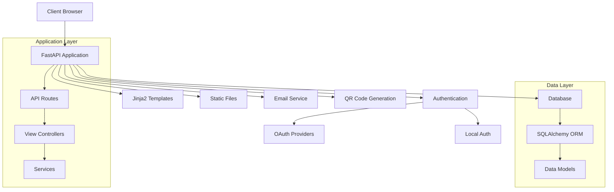

# System Architecture

This document provides an overview of the LeagueLedger system architecture to help developers understand the system's structure and components.

## Overview

LeagueLedger is built with a modern web architecture using FastAPI as the backend framework and a combination of server-rendered templates and JavaScript for the frontend. The system follows a modular design pattern to maintain separation of concerns and enable easy extension.

## Architecture Diagram



## Core Components

### Backend Framework

LeagueLedger uses [FastAPI](https://fastapi.tiangolo.com/), a modern, high-performance web framework for building APIs with Python 3.7+ based on standard Python type hints.

Key FastAPI components used:
- **Dependency Injection**: For database sessions, authentication, and other services
- **Pydantic Models**: For data validation and serialization
- **Middleware**: For session management, authentication, and error handling

### Database

The system uses SQLAlchemy as an ORM (Object-Relational Mapper) to interact with the database. Key database components include:

- **SQLAlchemy Models**: Defined in `app/models/`
- **Database Configuration**: Found in `app/db.py`
- **Migrations**: Handled through custom migration scripts in `app/db_migrations.py`

The data model centers around these core entities:
- **Users**: User accounts and authentication
- **Teams**: Groups of users competing together
- **TeamMemberships**: Relationship between users and teams
- **QRCodes**: Generated codes for awarding points
- **QRSets**: Collections of QR codes for specific events
- **Events**: Scheduled activities
- **TeamAchievements**: Recognitions earned by teams

### Authentication System

Authentication is handled through multiple mechanisms:

- **Session-based Authentication**: For traditional username/password login
- **OAuth Authentication**: For social login via multiple providers
- **Authentication Middleware**: Integrated with Starlette's authentication system

OAuth providers are implemented as pluggable components, allowing easy addition of new providers.

### Frontend

The frontend is primarily built with:

- **Jinja2 Templates**: For server-side rendering of HTML
- **Tailwind CSS**: For responsive styling
- **JavaScript**: For interactive elements
- **Static Assets**: CSS, JS, images stored in `app/static/`

### Template Engine

[Jinja2](https://jinja.palletsprojects.com/) is used as the template engine with:

- **Base Templates**: Providing layout scaffolding
- **Template Inheritance**: Enabling consistent UI across pages
- **Template Globals**: For user context and common functions

### QR Code System

QR codes are central to the application's functionality:

- **Generation**: Creating unique QR codes with the `qrcode` library
- **Scanning**: Web-based scanning using the device camera
- **Points Attribution**: Mapping scanned codes to point values and teams

### Internationalization

The application supports multiple languages through:

- **Babel**: For i18n infrastructure
- **Translation Files**: Stored in `app/i18n/locales/`
- **Language Selection**: User-configurable preferences

## Data Flow

### Request Lifecycle

1. **Client Request**: Browser sends HTTP request
2. **Middleware Processing**: Session, authentication, template globals
3. **Route Handling**: Matching URL to appropriate handler
4. **View Controller**: Processing business logic
5. **Database Interactions**: Through SQLAlchemy models
6. **Template Rendering**: Creating HTML with Jinja2
7. **Response**: Returning HTML or redirect to client

### Authentication Flow

1. **Login Request**: User submits credentials
2. **Verification**: Checking against stored hash
3. **Session Creation**: Creating session on successful auth
4. **OAuth Flow** (for social login):
   - Redirect to provider
   - Provider authentication
   - Callback with authorization code
   - Token exchange
   - User info retrieval
   - Account creation or linking

## Directory Structure

```
leagueledger/
├── app/                    # Application code
│   ├── auth/               # Authentication components
│   ├── i18n/               # Internationalization
│   ├── models/             # Database models
│   ├── static/             # Static files
│   ├── templates/          # HTML templates
│   ├── utils/              # Utility functions
│   └── views/              # View controllers
├── docs/                   # Documentation
├── scripts/                # Helper scripts
└── tests/                  # Test suite
```

## Development Patterns

### Dependency Injection

FastAPI's dependency injection system is used extensively to:
- Provide database sessions
- Ensure authentication
- Validate permissions
- Supply configuration

Example:
```python
@router.get("/secure-endpoint")
async def secure_endpoint(db: Session = Depends(get_db), 
                         current_user: User = Depends(get_current_user)):
    # Function implementation
```

### Service Pattern

Business logic is organized into service modules to separate concerns:
- **Data access**: Database operations
- **Business rules**: Application logic
- **Presentation**: View rendering and response formatting

### Error Handling

Centralized error handling through:
- **Exception handlers**: For API errors
- **Custom templates**: For user-friendly error pages
- **Logging**: Comprehensive error logging

## Next Steps

For more detailed information about the development aspects, refer to:

- [API Reference](api-reference.md)
- [Database Schema](database-schema.md)
- [Frontend Development](frontend-dev.md)
- [Backend Development](backend-dev.md)
- [Testing](testing.md)